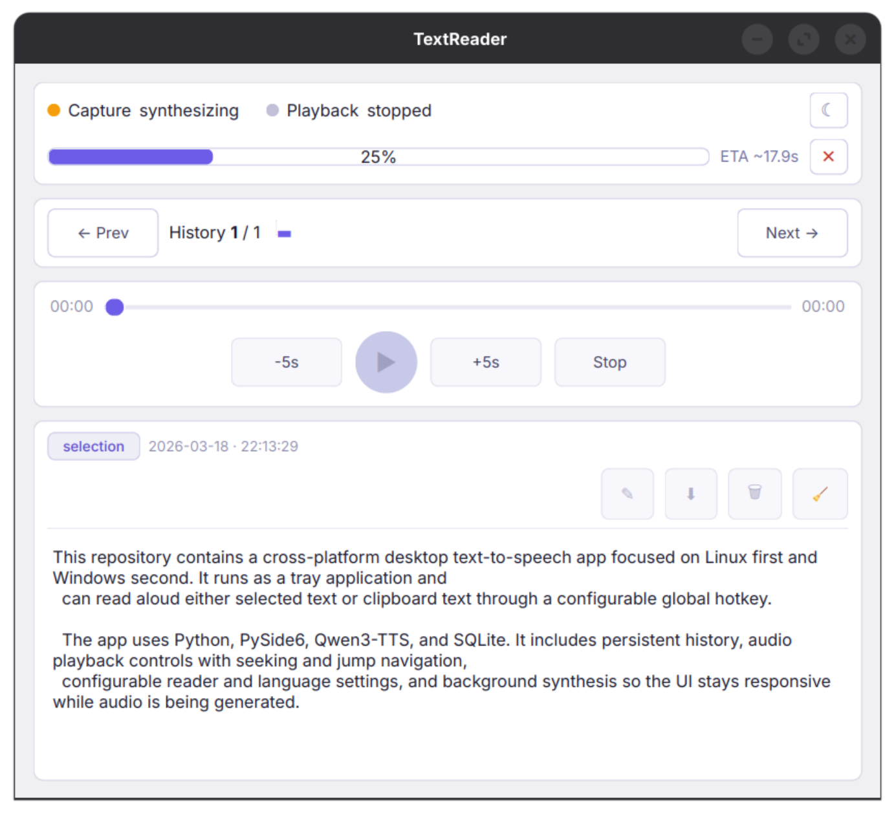
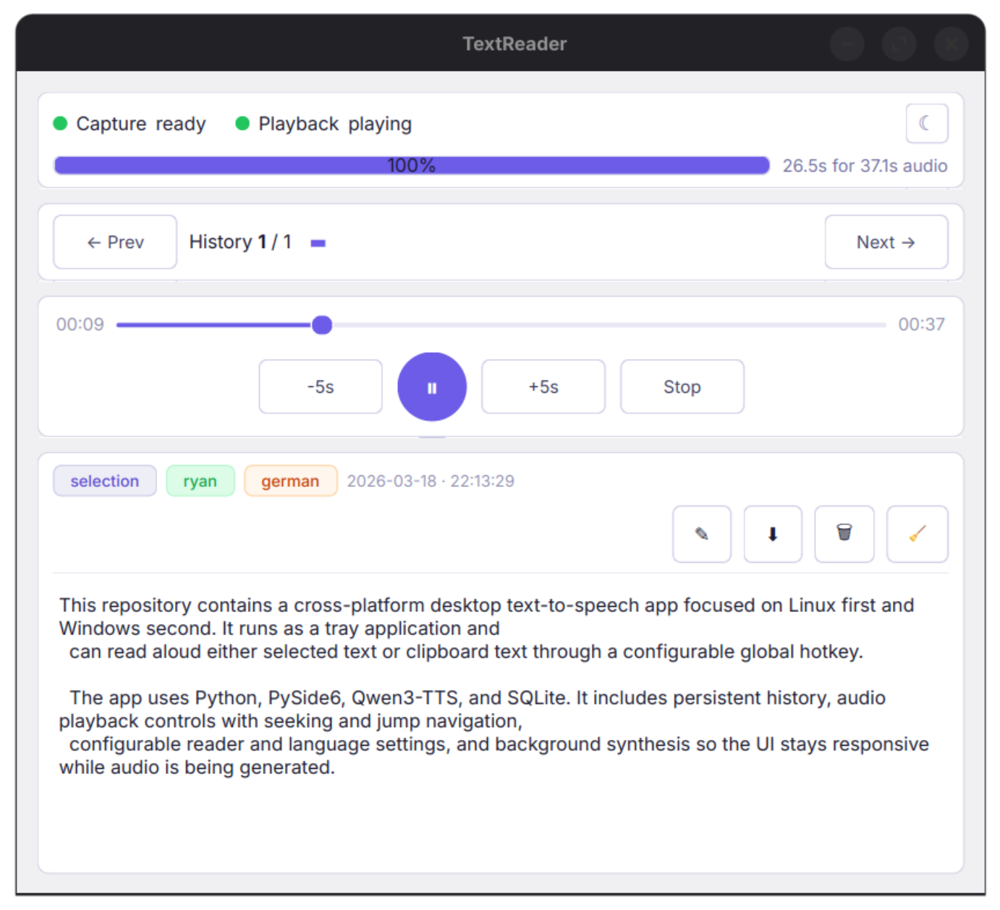
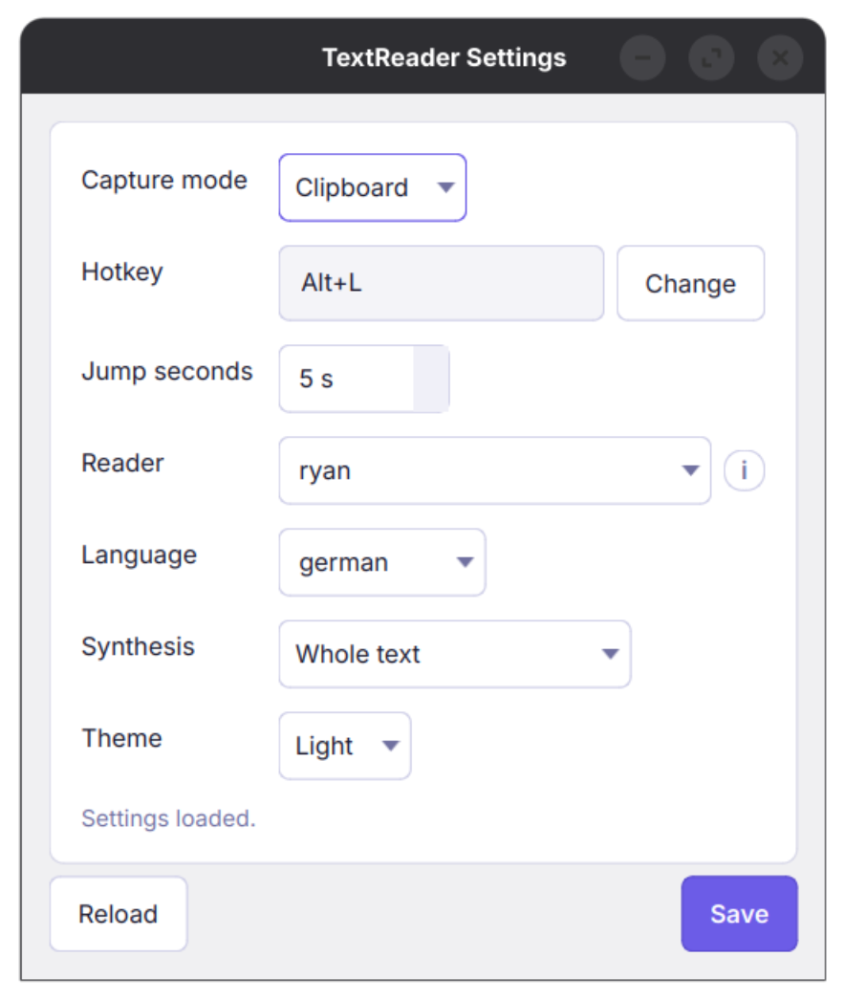
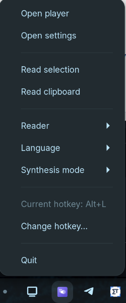

# 🔊 TextReader

> **Press a hotkey. Your computer reads it aloud.** TextReader is a tray-based desktop app that captures selected or clipboard text and synthesizes natural-sounding speech — locally, on your GPU, with no cloud required.

<br>

<table>
  <tr>
    <td align="center" width="50%">
      
      <br><sub><b>⚡ Live synthesis with ETA and cancel</b></sub>
    </td>
    <td align="center" width="50%">
      
      <br><sub><b>▶️ Full playback controls with seek</b></sub>
    </td>
  </tr>
  <tr>
    <td align="center" width="50%">
      
      <br><sub><b>⚙️ Configurable voice, language & hotkey</b></sub>
    </td>
    <td align="center" width="50%">
      
      <br><sub><b>🖥️ Always available in the system tray</b></sub>
    </td>
  </tr>
</table>

<br>

---

## ✨ Features at a Glance

| | Feature |
|---|---|
| 🎙️ | **AI-powered TTS** — Qwen3-TTS runs entirely locally on your GPU |
| ⌨️ | **Global hotkey** — trigger from anywhere, no window focus needed |
| 📋 | **Clipboard & selection** — read whatever you copied or highlighted |
| 📜 | **Persistent history** — every entry saved to SQLite, navigate freely |
| ⏱️ | **Real-time progress** — synthesis ETA, progress bar, and instant cancel |
| 🎛️ | **Full playback controls** — play/pause, seek, ±5 s jumps, stop |
| 🗣️ | **Multi-voice & multi-language** — switch reader and language on the fly |
| 🌙 | **Light / Dark theme** — clean Qt UI, switch from the tray |
| 🖥️ | **System tray app** — lives quietly in your taskbar until you need it |
| 💾 | **Audio export** — save any synthesis result as a WAV file |

---

## 🚀 Quick Start

### Prerequisites

- Python 3.11+
- PyTorch with ROCm (AMD GPU) **or** CUDA (NVIDIA GPU) — CPU fallback works but is slow
- Linux (primary) or Windows

### Install

```bash
git clone https://github.com/your-username/TextReader.git
cd TextReader

# Create and activate a virtual environment
python -m venv .venv
source .venv/bin/activate          # Linux / macOS
# .venv\Scripts\activate           # Windows

# Install the package
pip install -e .
```

> **Note for AMD GPU users:** Install PyTorch with ROCm support before running the above:
> ```bash
> pip3 install torch torchvision --index-url https://download.pytorch.org/whl/rocm7.1
> ```

### Run

```bash
text-reader-app
```

The app starts silently in the system tray. **The Qwen TTS model is downloaded automatically on first use** (~1–2 GB).

---

## 🎮 Usage

### The Core Loop

1. Select text anywhere on your screen (or copy it to the clipboard)
2. Press your hotkey (default: **`Alt+L`**)
3. The app synthesizes speech in the background — you see a progress bar
4. Audio begins playing automatically when synthesis completes
5. Use the player to pause, seek, or jump back/forward

### Player Controls

| Button | Action |
|--------|--------|
| ▶️ / ⏸️ | Play / Pause |
| ⏹️ Stop | Stop and reset position |
| `−5s` / `+5s` | Jump backward / forward |
| Seek slider | Scrub to any position |
| `✕` (red) | Cancel ongoing synthesis |
| `← Prev` / `Next →` | Navigate history entries |

### Tray Menu

Right-click the tray icon to:
- Open the player or settings
- Trigger **Read selection** or **Read clipboard** manually
- Switch **Reader** (voice), **Language**, or **Synthesis mode**
- Change the hotkey
- See the current hotkey at a glance

---

## ⚙️ Settings

Open settings from the tray icon or player window.

| Setting | Description |
|---------|-------------|
| **Capture mode** | `Clipboard` or `Selection` — what the hotkey reads |
| **Hotkey** | Any key combination; click *Change* to record a new one |
| **Jump seconds** | Duration of the ±N s skip buttons (default: 5 s) |
| **Reader** | TTS voice (e.g. `ryan`, `serena`) |
| **Language** | Language hint for synthesis (e.g. `german`, `english`) |
| **Synthesis** | `Whole text` (one pass) or `Streaming` (sentence-by-sentence) |
| **Theme** | `Light` or `Dark` |

Settings are persisted in SQLite and applied immediately on save.

---

## 🗄️ Data & Privacy

Everything runs **100% locally**. No data ever leaves your machine.

| Resource | Path |
|----------|------|
| Database (history + settings) | `~/.local/share/TextReader/text_reader.sqlite3` |
| Audio cache | `~/.local/share/TextReader/audio_cache/` |
| TTS model weights | Hugging Face cache (`~/.cache/huggingface/`) |

---

## 🏗️ Architecture

```
src/text_reader_app/
├── app_bootstrap.py          # Entry point, CLI, service wiring
├── application_controller.py # Central orchestrator
├── domain/models.py          # HistoryEntry, AppPreferences, enums
├── gui/                      # PySide6 windows, tray, synthesis worker
│   ├── player_window.py
│   ├── settings_window.py
│   ├── tray_controller.py
│   └── synthesis_worker.py   # Background TTS thread
├── hotkeys/                  # Global hotkey via evdev (Linux/Windows)
├── capture/                  # Clipboard & selection reading
├── tts/                      # Qwen3 TTS subprocess wrapper
├── audio/                    # Qt QMediaPlayer controller
├── history/                  # SQLite history repository
└── settings/                 # SQLite settings repository
```

**Key design decisions:**

- 🔄 **Persistent TTS subprocess** — the model stays loaded between requests; cancellation kills synthesis without reloading weights
- 🧵 **Background worker thread** — synthesis never blocks the UI
- 🗃️ **Repository pattern** — history and settings are cleanly separated from business logic
- 🚀 **Deferred init** — services start after the Qt event loop to avoid PipeWire deadlocks on Linux

---

## 🛠️ Tech Stack

| Component | Technology |
|-----------|------------|
| GUI framework | [PySide6](https://doc.qt.io/qtforpython/) (Qt 6) |
| TTS engine | [Qwen3-TTS](https://huggingface.co/Qwen/Qwen3-TTS) via PyTorch |
| Audio playback | Qt QMediaPlayer |
| Persistence | SQLite (via Python `sqlite3`) |
| Hotkeys (Linux) | [evdev](https://python-evdev.readthedocs.io/) |
| Hotkeys (Windows) | Low-level keyboard hook |
| Text capture | `wl-paste` / `xclip` (Linux), PowerShell (Windows) |

---

## 🖥️ Platform Support

| Platform | Status |
|----------|--------|
| 🐧 Linux (X11 / Wayland) | ✅ Primary target, fully tested |
| 🪟 Windows | 🔶 Code complete, runtime validation in progress |

---

## 🤝 Contributing

Pull requests are welcome! Before contributing, please read `AGENTS.md` for session guidance and architectural conventions.

1. Fork the repository
2. Create a feature branch: `git checkout -b feature/my-feature`
3. Commit your changes
4. Open a pull request

---

## 📄 License

This project is released under the [MIT License](LICENSE).

---

<div align="center">
  <sub>Built with 🧠 Qwen3-TTS · 🖥️ PySide6 · 🐍 Python 3.11+</sub>
</div>
